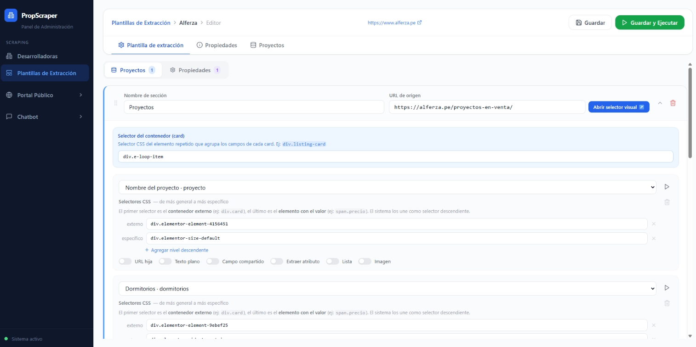
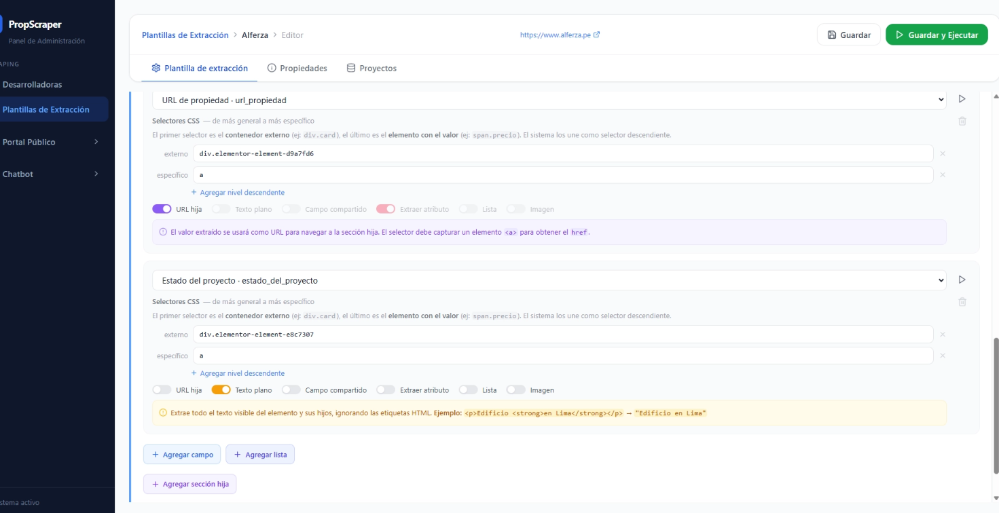
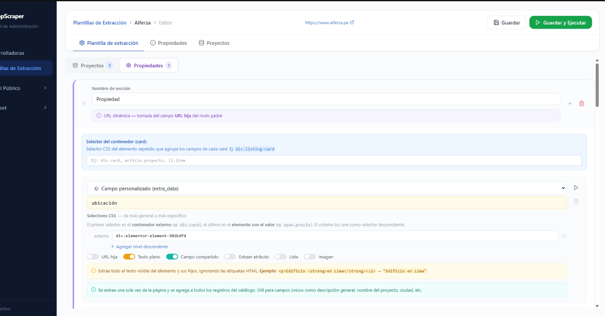
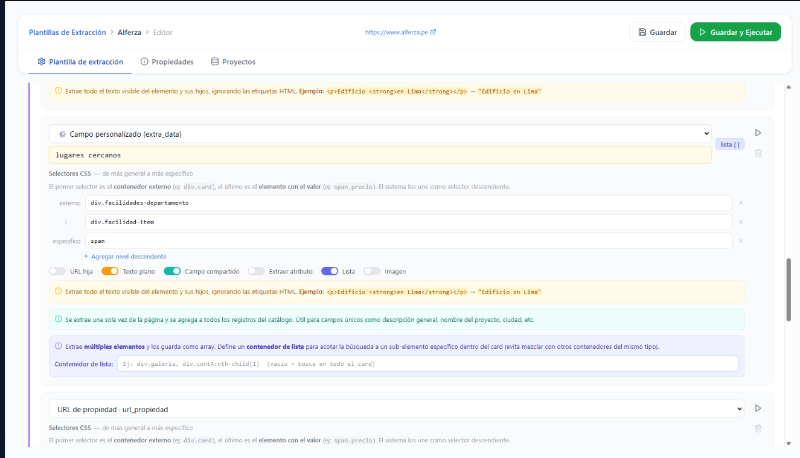

Bien, estuve viendo la BD y hay columnas que se repiten en unas tablas, redundancia innecesaria.

POR ESO REDISEÑÉ LAS TABLAS developers, propiedades y proyectos, y ahora se verán así:

**DEVELOPERS**

| id | name | description | base_url | logo_url | source | created_at | proyectos_url |
| --- | --- | --- | --- | --- | --- | --- | --- |
| 727e415d-c08b-413b-95e2-df943b1d4a12 | Test Developer | Descripcion actualizada | [https://example.com](https://example.com/) |  | MANUAL | 54:39.3 |  |
| 742e20f6-4e53-47c5-96e4-a1f5a1376bad | Ciudadis | Desarrolladora | https://www.ciudaris.com/ |  | MANUAL | 44:55.5 |  |

**PROPIEDADES**

| id | proyecto_id | status | scraped_at | imagen_modelo | dormitorios | m2 | modelo | modelo_imagen | extra_data |
| --- | --- | --- | --- | --- | --- | --- | --- | --- | --- |
| 8f4a7d21-6c8b-4c1f-9f3a | 4a2730f0-69d4-4517-a24c | SUCCESS | 02:11.6 | https://example.com/media/modelo-a.jpg | 3 | 82 m² | Flat Tipo A | https://example.com/media/proyecto-1.jpg | {"entrega":"2026","financiamiento":"BCP"} |
| 3b2c91fa-1d44-456e-a93f | 9b1e2f45-0a7c-421d-b6ea | SUCCESS | 55:35.1 | https://example.com/media/modelo-b.jpg | 2 | 65 m² | Departamento Tipo B | https://example.com/media/proyecto-2.jpg | {"bono":"MiVivienda","tipo":"departamento"} |
| f71e3c08-91ab-4f66-8a2e | 12ad56b8-8e2a-4e89-994a | SUCCESS | 58:21.9 | https://example.com/media/modelo-c.jpg | 1 | 48 m² | Loft Tipo C | https://example.com/media/proyecto-3.jpg | {"estacionamiento":false,"mascotas":true} |

**PROYECTOS**

| id | developer_id | status | scraped_at | estado_del_proyecto | ubicacion | imagen | extra_data | descripcion | areas_comunes_exterior_e_interior_img | areas_comunes_imagenes | precio_desde | lugares cercanos | nombre |
| --- | --- | --- | --- | --- | --- | --- | --- | --- | --- | --- | --- | --- | --- |
| a604fd11-e8fb-4614-be17 | 225031fb-28e6-454d | SUCCESS | 55:35.1 | En construcción | Surco | {"url":"/media/images/los-robles.jpg"} | {"tipo":"departamento","entrega":"2026"} | DESCRIPCIÓN DEL PROYECTO |  |  |  |  |  |
| e5c4d1c6-e2d8-4e64 | 225031fb-28e6-454d | SUCCESS | 55:35.1 | En planos | Breña | {"url":"/media/images/altos-valle.jpg"} | {"tipo":"departamento","bono":"MiVivienda"} |  |  |  |  |  |  |
| 38dc58bc-a98a-424c | 225031fb-28e6-454d | SUCCESS | 55:35.1 | Entrega inmediata | Jesús María | {"url":"/media/images/vista-parque.jpg"} | {"tipo":"flat","estacionamiento":true} |  |  |  |  |  |  |

PARA ELLO A CONTINUACIÓN TE EXPLICARÉ COMO SE GUARDARÁN ALGUNOS DATOS Y LA RAZÓN PO LA QUE SE PROPUSO ESTE NUEVO DISEÑO:

Empecemos con la tabla Developers, esta no se cambió, se mantiene igual, solo se agregó proyectos_url para poner la url donde está el catálogo de proyectos.

Respecto a la tabla proyectos se eliminó url_node_id porque era innecesario en este nuevo diseño ya que si queremos saber el padre del proyecto lo haremos a través del developer_id, se quitó source_url por redundancia, url_propiedad no debería existir (o al menos aquí se usa ya que todas los modelos de propiedades provienen de un mismo url), otros parametros como dormitorios, m2 se quitaron porque son parametros de propiedades, se agregó el parámetro descripción para las descripciones de cada proyecto, areas_comunes_exterior_e_interior_img guarda un json con las urls de las imagenes categorizadas en (interior, areas_comunes y exterior) , areas_comunes almacena en un array la lista de áreas comunes que tiene el proyecto (texto).

por cierto todos los que acaban en *at por ejemplo scraped_at debería guardarse en formato timestamp o algun formato que guarde no solo la hora y segundos exactos, sino también la fecha. lugares cercanos almacena una lista de los nombres de los lugares cercanos en json.*

Ahora, respecto a la tabla propiedades, se quito developer_id ya que a través de la tabla proyectos será posible saber a que desarrolladora pertenece, url_node, url_Propiedad y source_url también los quite ya que en la tabla propiedades no suele haber url para cada modelo de propiedad, estado_del_proyecto y ubicacion se puede saber a traves de la tabla proyecto, lugares_cercanos, proyecto también los quite porque se sabe a través de los proyectos, 

Y bueno eso serían los cambios, obviamente se tendrá que adaptar el resto del sistema y aquí viene la segunda parte, las plantillas de extracción:

quiero que lo mantengas tal como está pero ahora te voy a decir como guardar la información se´gun la plantilla, por ejemplo: la plantilla de alferza:

actualmente está así (adjunto primera imagen),haremos el siguiente cambio: el nombre de sección estará por defecto en “Proyectos”, la URL de origen se guarda en la tabla **DEVELOPERS** en la columna .. así es, en la columna proyectos_url

“nombre del proyecto . proyecto”: cada nombre extraído se guarda en… → tabla proyectos columna nombre.

“Dormitorios . dormitorios”, “Metros cuadrados (m2) . m2”: los guarda en “extra_data” dentro del json que guarda

(adjunto segunda imagen)

“Estado del proyecto . estado_del_proyecto”: se guarda en la tabla de proyectos en la columna estado_del_proyecto.

por cierta seguirá siendo necesario la” url de propiedad . url_propiedad” o en este caso sería url del proyecto, donde al hacer click sobre el enlace se abrirá los detalles del proyecto: descripción, modelos que ofrece, areas comunes, interior, etc.

La siguiente parte es “Propiedades”: el nombre de sección debe quedar por defecto en Propiedad, y aquí te voy a explicar como se guardan “campos compartidos”

aquellos marcados como campos compartidos son propiedades de la tabla proyectos, por ejemplo aquí: ubnicación tiene marcado “campo compartido” por lo que el dato que se extraerá se irá a la tabla proyectos, en la columna ubicación.

(adjunto otra imagen)

aquí también hay otro campo compartido, eso significa que los datos de “lugares cercanos” se irán a la columna lugares cercanos de la tabla proyectos.

Según lo que se explicó quiero que refactoices todo para que se guarde según las tablas que te mostré (en la bd) también ten una copia de respaldo de la tabla “plantillas de extracción” en español, y tendrás que guardar de otra manera las plantillas actuales para usarlos en este nuevo esquema, dando los nombres de los campos (que ahora ya no serán personalizadas sino estandarizadas según el nuevo esquema. mientras estás configurando quiero que te ayudes de la herramienta scraping que tenemos para que compruebes la información que se extrae de las plantillas actuales ypoder configurarles como es debido.

solo eso, trata de no romper el sistema, y manten el chatbot y todo lo demás funcionando con la refactorización que se hará.